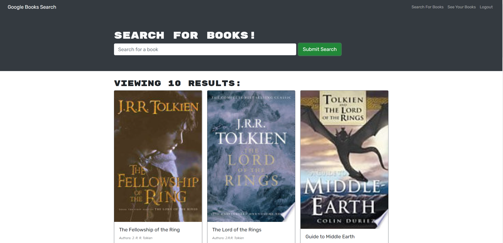
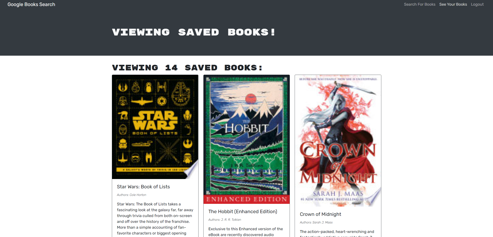

# MERN Google Book Search Engine

This MERN stack application is a readers best friend for researching books to potentially read/purchase later! This book search engine  allows users to search for books they are intereseted in. Users are then able to save and delete those books from their saved books list!

##  Links
Deployed Heroku App: https://fast-island-14732.herokuapp.com/

Github: https://github.com/lhaykus/MernBookSearch
# Table of Contents
- [App](#app)
- [Built With](#built-with)
- [Installation](#installation)
- [Usage](#usage)
- [Credits](#credits)

# App
Quick Walkthrough


Book Search


My Saved Books



# Built With 
* MERN Stack
* React front-end
* MongoDB database
* Node.js/Express.js server 
* GraphQl
* Apollo Server


# Installation
To use this MERN Book Search engine
* Fork/clone this repository
* Run *npm i* to install all needed packages (**make sure to have node.js installed**)

# Usage
Install all needed packages

```
npm i
```

Start server

```
npm start 
```

Search for any book you want, save them to your page and enjoy!


# Credits 
Starting code provided by © 2021 Trilogy Education Services, LLC, a 2U, Inc. brand. Confidential and Proprietary. All Rights Reserved.